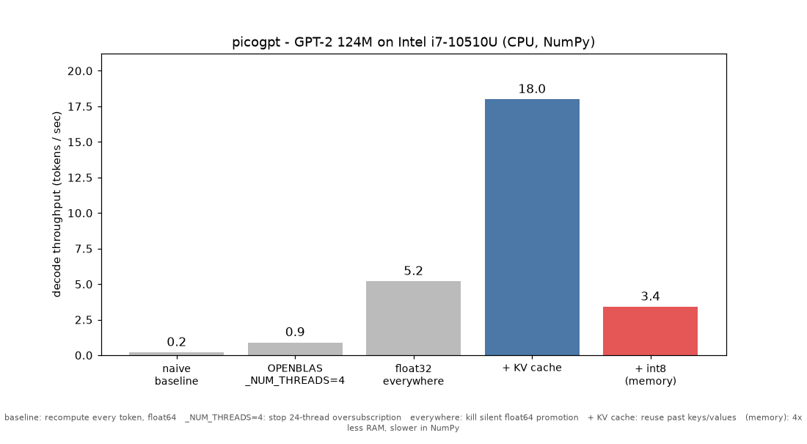

# picogpt

A minimal LLM inference engine: runs GPT-2 (124M) with a hand-written forward
pass in plain NumPy. No PyTorch or `transformers` in the engine itself (they're
used only as a correctness reference).

On an Intel i7-10510U (CPU only): ~24 tokens/sec decode with the KV cache.



## Setup

```bash
python -m venv .venv
.venv/Scripts/python -m pip install -r requirements.txt
.venv/Scripts/python scripts/download_weights.py
```

## Generate

```bash
.venv/Scripts/python scripts/run.py "The capital of France is" -n 20
.venv/Scripts/python scripts/run.py "Once upon a time" -n 100 -t 0.8 --top-k 40
```

Flags: `-n` tokens, `-t` temperature, `--top-k`, `--top-p`, `--seed`,
`--no-cache`, `--quantize`.

## Benchmark

```bash
.venv/Scripts/python benchmarks/bench.py --new-tokens 48 --reps 4 --plot --int8
.venv/Scripts/python benchmarks/phases_plot.py
```

## Verify

```bash
.venv/Scripts/python -m pip install -r requirements-dev.txt
.venv/Scripts/python scripts/check_reference.py
.venv/Scripts/python -m pytest -q
```

## Layout

| Path | What |
|---|---|
| `pico/model.py`     | forward pass + KV cache |
| `pico/tokenizer.py` | BPE via tiktoken |
| `pico/weights.py`   | download + load weights |
| `pico/quant.py`     | int8 weight quantization |
| `pico/sample.py`    | greedy / temperature / top-k / top-p |
| `pico/generate.py`  | generation loop + timing |
| `scripts/`          | CLI entry points |
| `benchmarks/`       | harness, plots, results |
| `tests/`            | smoke + reference tests |

Numbers and the change log are in [NOTES.md](NOTES.md).
